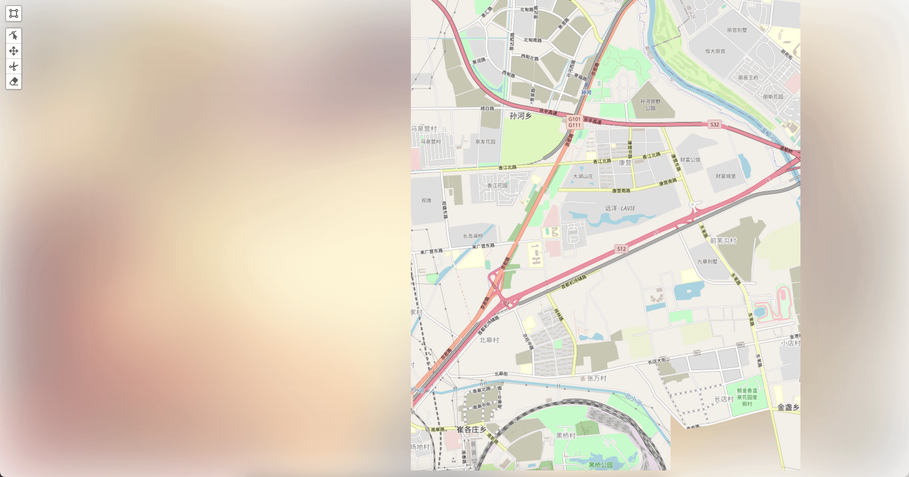

# LMapView

## 地图瓦片本地载入示例

## 项目初始化

```
npm install
```

### 项目启动

```
npm run serve
```

### 项目打包

```
npm run build
```

### 项目测试

```
npm run test
```

### Eslint检查

```
npm run lint
```

#### 效果图



